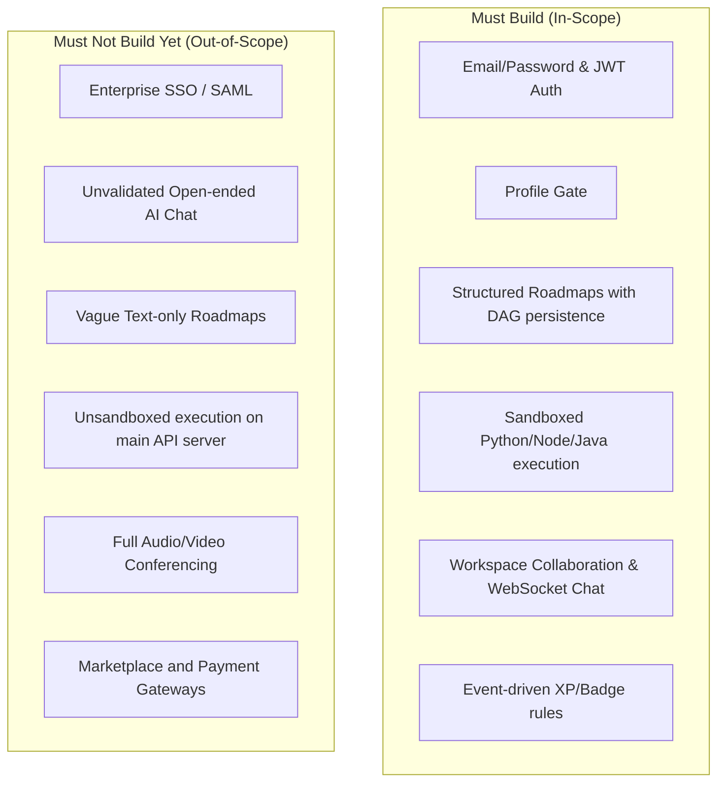
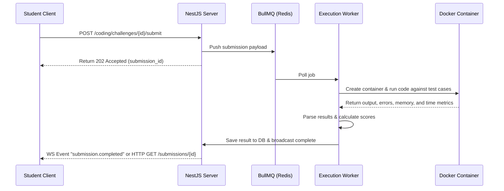
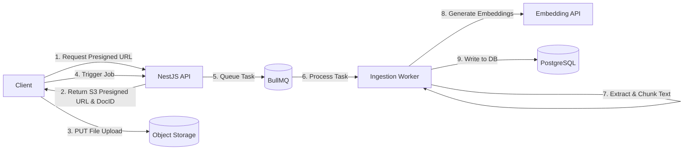

# NexLearn AI-Driven Features: Backend Production Specification

**Document Version**: v1.0  
**Status**: APPROVED  
**Target Stack**: NestJS (TypeScript), PostgreSQL + pgvector, Redis + BullMQ  
**Environment**: Production Ready  

---

## 1. Executive Implementation Summary

The NexLearn backend is designed as a modular monolith using NestJS, structured to support high-scale AI tutoring, dynamic roadmaps, sandboxed code execution, gamified progression, and real-time collaboration. The objective is to build a reliable, auditable, and secure backend that preserves student progress, isolates untrusted code execution, and operates AI models with strict schema guarantees.

### Key Architectural Decisions
- **Modularity**: Domain-driven directory structure within a single NestJS codebase to facilitate a future microservices migration if required.
- **Data Persistence**: PostgreSQL 16+ as the single source of truth, utilizing `pgvector` for vector embeddings. Redis for caching, rate-limiting, WebSocket session management, and BullMQ task queues.
- **AI Orchestration**: Isolated orchestrator service that parses and validates all LLM responses against Zod/JSON schemas, logs token costs, and handles retries.
- **Code Execution**: Disposable Docker containers running inside an isolated sandbox network to validate student code submissions safely.
- **Event-Driven Progress**: Key actions emit learning events processed asynchronously to update gamification stats, analytics, and streaks.

---

## 2. Feature Inventory Extracted From the UI

| Priority | Feature | UI Promise | Backend Capability Required |
| :--- | :--- | :--- | :--- |
| **P0** | **AI Study Assistant** | Context-aware tutoring, instant answers, steps. | LLM + RAG + user profile + conversation context. |
| **P0** | **Smart Roadmap** | AI-generated learning paths tailored to career goals. | Dynamic DAG generator, progress tracker, node editing. |
| **P0** | **Live Coding Practice** | 500+ challenges with real-time feedback. | Code execution workers, sandbox env, test runner. |
| **P0** | **Performance Analytics** | Insights into learning patterns, strengths, weaknesses. | Event-sourced metrics pipeline, aggregation tables, analytics API. |
| **P0** | **Team Collaboration** | Real-time shared workspaces, chat, and notes. | Workspaces, WebSocket presence, chat history, shared-notes lock. |
| **P0** | **Gamification System** | Streaks, badges, XP, leaderboards. | XP ledger, streak processor, badge rule engine. |
| **P1** | **Daily Goals Tracker** | Daily goals, reminders, status tracking. | Goals CRUD, timezone calculator, daily cron validator. |
| **P1** | **AI Notes Summarizer** | Summary, flashcards, mind maps, quizzes from uploads. | S3 storage, text extraction (OCR/PDF), embedding generation, chunks. |
| **P1** | **Productivity Tracker** | Focus timer, energy tracking, AI recommendations. | Focus session logging, recommendation compiler. |
| **P2** | **Hackathon Hub** | Discover, team formation, project tracking, submission. | Hackathon registry, team CRUD, milestone tracker. |

---

## 3. Production Scope Lock



---

## 4. Target Backend Architecture

The backend uses **NestJS (TypeScript)** as the API gateway and application runtime.

### 4.1 recommended Runtime Stack
- **API Runtime**: NestJS v10+, Node.js v22 (LTS)
- **Database**: PostgreSQL v16+, `pgvector` extension enabled
- **Cache & Message Broker**: Redis v7.2+
- **Job Orchestrator**: BullMQ (NestJS wrapper `@nestjs/bullmq`)
- **ORM**: Prisma v5+ or TypeORM v0.3+
- **Sandbox Isolation**: Docker / Firecracker microVMs on separate worker hosts

### 4.2 Module Boundary Map
```
src/
├── app.module.ts
├── modules/
│   ├── auth/            # Users, JWT sessions, passport-jwt
│   ├── profile/         # Career goals, skills, onboarding checks
│   ├── ai-tutor/        # Chat sessions, messages, context grounding
│   ├── roadmap/         # Roadmaps, nodes, sequence tracking, DAG check
│   ├── goals/           # Daily goals, timezone scheduler
│   ├── coding/          # Challenges, submissions queue, test runners
│   ├── notes/           # Document ingestion, OCR, chunking, embeddings
│   ├── collaboration/   # Workspaces, ws gateways, message logger
│   ├── analytics/       # Event handlers, aggregation engines, trend cache
│   ├── gamification/    # XP ledger, badge rules, streak manager
│   ├── productivity/    # Focus timer tracking, recommendations
│   ├── hackathon/       # Team creation, milestones, submissions
│   └── operations/      # Audit logging, rate limits, feature flags
└── shared/
    ├── ai-orchestrator/ # Single AI provider gateway, prompt templates
    └── filters/         # Global exception filters
```

### 4.3 Request Flow Rules
1. **Authentication Gate**: Every endpoint except `/auth/*` and public endpoints must be guarded by a JWT token validator. The payload must map to `req.user.id`.
2. **AI Audit Log**: Every AI interaction must pre-register an `ai_runs` record with state `pending` and commit tokens/latencies upon completion/error.
3. **Event Loop Pub/Sub**: Modules must not update other module domains directly. Instead, they emit NestJS events (e.g., `EventEmitter2.emit('goal.completed')`), which the `Analytics` and `Gamification` modules handle asynchronously.
4. **Code Execution Isolation**: Code submitted via `/coding/challenges/{id}/submit` must not run on the API runtime. It is pushed to Redis BullMQ `code_runner_queue`, picked up by isolated worker daemons, executed in a container, and the result written back to the DB before notifying the client via WebSocket or polling.

---

## 5. Core Database Model

### 5.1 Minimal SQL DDL Blueprint

```sql
-- Enable UUID and vector support.
CREATE EXTENSION IF NOT EXISTS pgcrypto;
CREATE EXTENSION IF NOT EXISTS vector;

-- Domain: Identity
CREATE TABLE users (
  id UUID PRIMARY KEY DEFAULT gen_random_uuid(),
  email TEXT NOT NULL UNIQUE,
  password_hash TEXT NOT NULL,
  full_name TEXT NOT NULL,
  role TEXT NOT NULL DEFAULT 'student' CHECK (role IN ('student','admin')),
  status TEXT NOT NULL DEFAULT 'active' CHECK (status IN ('active','blocked','deleted')),
  created_at TIMESTAMPTZ NOT NULL DEFAULT now(),
  updated_at TIMESTAMPTZ NOT NULL DEFAULT now()
);

CREATE TABLE user_profiles (
  user_id UUID PRIMARY KEY REFERENCES users(id) ON DELETE CASCADE,
  target_career TEXT,
  current_level TEXT CHECK (current_level IN ('beginner','intermediate','advanced')),
  weekly_hours INT CHECK (weekly_hours BETWEEN 1 AND 80),
  preferred_language TEXT DEFAULT 'en',
  learning_style TEXT CHECK (learning_style IN ('visual','text','practice','mixed')),
  timezone TEXT NOT NULL DEFAULT 'UTC',
  updated_at TIMESTAMPTZ NOT NULL DEFAULT now()
);

-- Domain: Operations & Audit
CREATE TABLE audit_logs (
  id UUID PRIMARY KEY DEFAULT gen_random_uuid(),
  user_id UUID REFERENCES users(id) ON DELETE SET NULL,
  action TEXT NOT NULL,
  entity_type TEXT NOT NULL,
  entity_id UUID,
  ip_address TEXT,
  user_agent TEXT,
  metadata JSONB NOT NULL DEFAULT '{}',
  created_at TIMESTAMPTZ NOT NULL DEFAULT now()
);

-- Domain: Analytics Event Ledger
CREATE TABLE learning_events (
  id UUID PRIMARY KEY DEFAULT gen_random_uuid(),
  user_id UUID NOT NULL REFERENCES users(id) ON DELETE CASCADE,
  event_type TEXT NOT NULL,
  entity_type TEXT,
  entity_id UUID,
  points INT DEFAULT 0,
  metadata JSONB NOT NULL DEFAULT '{}',
  occurred_at TIMESTAMPTZ NOT NULL DEFAULT now()
);

CREATE INDEX idx_learning_events_user_time ON learning_events(user_id, occurred_at DESC);
CREATE INDEX idx_learning_events_type ON learning_events(event_type);

-- Domain: AI Orchestrator
CREATE TABLE ai_runs (
  id UUID PRIMARY KEY DEFAULT gen_random_uuid(),
  user_id UUID NOT NULL REFERENCES users(id) ON DELETE CASCADE,
  feature TEXT NOT NULL,
  provider TEXT NOT NULL,
  model TEXT NOT NULL,
  prompt_version TEXT NOT NULL,
  input_hash TEXT NOT NULL,
  output_status TEXT NOT NULL CHECK (output_status IN ('pending','success','failed','invalid')),
  latency_ms INT,
  input_tokens INT DEFAULT 0,
  output_tokens INT DEFAULT 0,
  cost_usd NUMERIC(10,6) DEFAULT 0,
  error_code TEXT,
  created_at TIMESTAMPTZ NOT NULL DEFAULT now()
);

-- Domain: AI Tutor
CREATE TABLE ai_tutor_sessions (
  id UUID PRIMARY KEY DEFAULT gen_random_uuid(),
  user_id UUID NOT NULL REFERENCES users(id) ON DELETE CASCADE,
  title TEXT NOT NULL,
  subject TEXT,
  mode TEXT NOT NULL DEFAULT 'tutor' CHECK (mode IN ('tutor','quiz_help','debugging','revision')),
  created_at TIMESTAMPTZ NOT NULL DEFAULT now(),
  updated_at TIMESTAMPTZ NOT NULL DEFAULT now()
);

CREATE TABLE ai_tutor_messages (
  id UUID PRIMARY KEY DEFAULT gen_random_uuid(),
  session_id UUID NOT NULL REFERENCES ai_tutor_sessions(id) ON DELETE CASCADE,
  role TEXT NOT NULL CHECK (role IN ('user','assistant','system')),
  content TEXT NOT NULL,
  citations JSONB NOT NULL DEFAULT '[]',
  token_count INT DEFAULT 0,
  created_at TIMESTAMPTZ NOT NULL DEFAULT now()
);

-- Domain: Roadmap
CREATE TABLE roadmaps (
  id UUID PRIMARY KEY DEFAULT gen_random_uuid(),
  user_id UUID NOT NULL REFERENCES users(id) ON DELETE CASCADE,
  title TEXT NOT NULL,
  target_career TEXT NOT NULL,
  current_level TEXT NOT NULL,
  timeline_weeks INT NOT NULL CHECK (timeline_weeks BETWEEN 1 AND 104),
  status TEXT NOT NULL DEFAULT 'active' CHECK (status IN ('draft','active','completed','archived')),
  ai_run_id UUID REFERENCES ai_runs(id),
  created_at TIMESTAMPTZ NOT NULL DEFAULT now(),
  updated_at TIMESTAMPTZ NOT NULL DEFAULT now()
);

CREATE TABLE roadmap_nodes (
  id UUID PRIMARY KEY DEFAULT gen_random_uuid(),
  roadmap_id UUID NOT NULL REFERENCES roadmaps(id) ON DELETE CASCADE,
  parent_node_id UUID REFERENCES roadmap_nodes(id) ON DELETE SET NULL,
  title TEXT NOT NULL,
  description TEXT,
  skill_tag TEXT NOT NULL,
  sequence_no INT NOT NULL,
  difficulty TEXT CHECK (difficulty IN ('easy','medium','hard')),
  estimated_hours NUMERIC(5,2) NOT NULL,
  prerequisite_node_ids UUID[] DEFAULT '{}',
  acceptance_task TEXT NOT NULL,
  status TEXT NOT NULL DEFAULT 'not_started' CHECK (status IN ('not_started','in_progress','completed','skipped')),
  due_week INT CHECK (due_week BETWEEN 1 AND 104)
);

CREATE UNIQUE INDEX idx_roadmap_nodes_sequence ON roadmap_nodes(roadmap_id, sequence_no);

-- Domain: Goals
CREATE TABLE daily_goals (
  id UUID PRIMARY KEY DEFAULT gen_random_uuid(),
  user_id UUID NOT NULL REFERENCES users(id) ON DELETE CASCADE,
  title TEXT NOT NULL,
  description TEXT,
  goal_date DATE NOT NULL,
  source TEXT NOT NULL DEFAULT 'manual' CHECK (source IN ('manual','roadmap','ai_suggested')),
  target_minutes INT CHECK (target_minutes BETWEEN 5 AND 720),
  status TEXT NOT NULL DEFAULT 'pending' CHECK (status IN ('pending','in_progress','completed','missed','cancelled')),
  created_at TIMESTAMPTZ NOT NULL DEFAULT now(),
  updated_at TIMESTAMPTZ NOT NULL DEFAULT now()
);

CREATE INDEX idx_daily_goals_user_date ON daily_goals(user_id, goal_date);

-- Domain: Coding Practice
CREATE TABLE code_challenges (
  id UUID PRIMARY KEY DEFAULT gen_random_uuid(),
  slug TEXT NOT NULL UNIQUE,
  title TEXT NOT NULL,
  description_md TEXT NOT NULL,
  difficulty TEXT NOT NULL CHECK (difficulty IN ('easy','medium','hard')),
  skill_tag TEXT NOT NULL,
  supported_languages TEXT[] NOT NULL,
  starter_code JSONB NOT NULL DEFAULT '{}',
  status TEXT NOT NULL DEFAULT 'published' CHECK (status IN ('draft','published','archived')),
  created_at TIMESTAMPTZ NOT NULL DEFAULT now()
);

CREATE TABLE challenge_test_cases (
  id UUID PRIMARY KEY DEFAULT gen_random_uuid(),
  challenge_id UUID NOT NULL REFERENCES code_challenges(id) ON DELETE CASCADE,
  input JSONB NOT NULL,
  expected_output JSONB NOT NULL,
  is_hidden BOOLEAN NOT NULL DEFAULT false,
  weight INT NOT NULL DEFAULT 1
);

CREATE TABLE code_submissions (
  id UUID PRIMARY KEY DEFAULT gen_random_uuid(),
  user_id UUID NOT NULL REFERENCES users(id) ON DELETE CASCADE,
  challenge_id UUID NOT NULL REFERENCES code_challenges(id) ON DELETE CASCADE,
  language TEXT NOT NULL,
  source_code TEXT NOT NULL,
  status TEXT NOT NULL CHECK (status IN ('queued','running','accepted','wrong_answer','runtime_error','timeout','compile_error')),
  score NUMERIC(5,2) DEFAULT 0,
  runtime_ms INT,
  memory_kb INT,
  created_at TIMESTAMPTZ NOT NULL DEFAULT now()
);

-- Domain: Notes Summarizer
CREATE TABLE study_documents (
  id UUID PRIMARY KEY DEFAULT gen_random_uuid(),
  user_id UUID NOT NULL REFERENCES users(id) ON DELETE CASCADE,
  title TEXT NOT NULL,
  file_key TEXT NOT NULL,
  mime_type TEXT NOT NULL,
  file_size_bytes BIGINT NOT NULL,
  status TEXT NOT NULL CHECK (status IN ('uploaded','processing','ready','failed','deleted')),
  extracted_text_hash TEXT,
  created_at TIMESTAMPTZ NOT NULL DEFAULT now()
);

CREATE TABLE document_chunks (
  id UUID PRIMARY KEY DEFAULT gen_random_uuid(),
  document_id UUID NOT NULL REFERENCES study_documents(id) ON DELETE CASCADE,
  chunk_index INT NOT NULL,
  content TEXT NOT NULL,
  token_count INT NOT NULL,
  embedding vector(1536),
  page_number INT,
  UNIQUE(document_id, chunk_index)
);

CREATE TABLE generated_summaries (
  id UUID PRIMARY KEY DEFAULT gen_random_uuid(),
  document_id UUID NOT NULL REFERENCES study_documents(id) ON DELETE CASCADE,
  summary_type TEXT NOT NULL CHECK (summary_type IN ('short','detailed','exam_revision')),
  content JSONB NOT NULL,
  ai_run_id UUID REFERENCES ai_runs(id),
  created_at TIMESTAMPTZ NOT NULL DEFAULT now()
);

CREATE TABLE flashcards (
  id UUID PRIMARY KEY DEFAULT gen_random_uuid(),
  document_id UUID NOT NULL REFERENCES study_documents(id) ON DELETE CASCADE,
  question TEXT NOT NULL,
  answer TEXT NOT NULL,
  created_at TIMESTAMPTZ NOT NULL DEFAULT now()
);

CREATE TABLE generated_quizzes (
  id UUID PRIMARY KEY DEFAULT gen_random_uuid(),
  document_id UUID NOT NULL REFERENCES study_documents(id) ON DELETE CASCADE,
  title TEXT NOT NULL,
  questions JSONB NOT NULL, -- Array of objects: { question, options: [], answer_key }
  created_at TIMESTAMPTZ NOT NULL DEFAULT now()
);

-- Domain: Collaboration
CREATE TABLE workspaces (
  id UUID PRIMARY KEY DEFAULT gen_random_uuid(),
  owner_id UUID NOT NULL REFERENCES users(id) ON DELETE CASCADE,
  name TEXT NOT NULL,
  description TEXT,
  visibility TEXT NOT NULL DEFAULT 'private' CHECK (visibility IN ('private','invite_link')),
  created_at TIMESTAMPTZ NOT NULL DEFAULT now()
);

CREATE TABLE workspace_members (
  workspace_id UUID NOT NULL REFERENCES workspaces(id) ON DELETE CASCADE,
  user_id UUID NOT NULL REFERENCES users(id) ON DELETE CASCADE,
  role TEXT NOT NULL CHECK (role IN ('owner','admin','member','viewer')),
  joined_at TIMESTAMPTZ NOT NULL DEFAULT now(),
  PRIMARY KEY (workspace_id, user_id)
);

CREATE TABLE workspace_messages (
  id UUID PRIMARY KEY DEFAULT gen_random_uuid(),
  workspace_id UUID NOT NULL REFERENCES workspaces(id) ON DELETE CASCADE,
  sender_id UUID NOT NULL REFERENCES users(id) ON DELETE CASCADE,
  message TEXT NOT NULL,
  attachment_ids UUID[] DEFAULT '{}',
  created_at TIMESTAMPTZ NOT NULL DEFAULT now(),
  deleted_at TIMESTAMPTZ
);

CREATE TABLE shared_notes (
  id UUID PRIMARY KEY DEFAULT gen_random_uuid(),
  workspace_id UUID NOT NULL REFERENCES workspaces(id) ON DELETE CASCADE,
  title TEXT NOT NULL,
  content TEXT NOT NULL,
  version INT NOT NULL DEFAULT 1,
  updated_by UUID REFERENCES users(id),
  updated_at TIMESTAMPTZ NOT NULL DEFAULT now()
);

-- Domain: Gamification
CREATE TABLE xp_events (
  id UUID PRIMARY KEY DEFAULT gen_random_uuid(),
  user_id UUID NOT NULL REFERENCES users(id) ON DELETE CASCADE,
  source_event_id UUID NOT NULL REFERENCES learning_events(id) ON DELETE CASCADE,
  points INT NOT NULL CHECK (points > 0),
  reason TEXT NOT NULL,
  created_at TIMESTAMPTZ NOT NULL DEFAULT now(),
  UNIQUE(source_event_id)
);

CREATE TABLE badges (
  id UUID PRIMARY KEY DEFAULT gen_random_uuid(),
  code TEXT NOT NULL UNIQUE,
  name TEXT NOT NULL,
  description TEXT NOT NULL,
  icon_key TEXT,
  status TEXT NOT NULL DEFAULT 'active' CHECK (status IN ('active','archived')),
  created_at TIMESTAMPTZ NOT NULL DEFAULT now()
);

CREATE TABLE user_badges (
  user_id UUID NOT NULL REFERENCES users(id) ON DELETE CASCADE,
  badge_id UUID NOT NULL REFERENCES badges(id) ON DELETE CASCADE,
  awarded_event_id UUID REFERENCES learning_events(id) ON DELETE SET NULL,
  awarded_at TIMESTAMPTZ NOT NULL DEFAULT now(),
  PRIMARY KEY (user_id, badge_id)
);

CREATE TABLE streaks (
  user_id UUID PRIMARY KEY REFERENCES users(id) ON DELETE CASCADE,
  current_streak INT NOT NULL DEFAULT 0,
  longest_streak INT NOT NULL DEFAULT 0,
  last_activity_date DATE NOT NULL,
  updated_at TIMESTAMPTZ NOT NULL DEFAULT now()
);

-- Domain: Productivity
CREATE TABLE focus_sessions (
  id UUID PRIMARY KEY DEFAULT gen_random_uuid(),
  user_id UUID NOT NULL REFERENCES users(id) ON DELETE CASCADE,
  goal_id UUID REFERENCES daily_goals(id) ON DELETE SET NULL,
  roadmap_node_id UUID REFERENCES roadmap_nodes(id) ON DELETE SET NULL,
  started_at TIMESTAMPTZ NOT NULL,
  ended_at TIMESTAMPTZ,
  planned_minutes INT CHECK (planned_minutes BETWEEN 5 AND 240),
  actual_minutes INT,
  status TEXT NOT NULL CHECK (status IN ('running','completed','abandoned')),
  energy_before INT CHECK (energy_before BETWEEN 1 AND 5),
  energy_after INT CHECK (energy_after BETWEEN 1 AND 5)
);

-- Domain: Hackathons (P2)
CREATE TABLE hackathons (
  id UUID PRIMARY KEY DEFAULT gen_random_uuid(),
  title TEXT NOT NULL,
  description TEXT NOT NULL,
  start_date TIMESTAMPTZ NOT NULL,
  end_date TIMESTAMPTZ NOT NULL,
  status TEXT NOT NULL DEFAULT 'upcoming' CHECK (status IN ('upcoming','active','ended')),
  created_at TIMESTAMPTZ NOT NULL DEFAULT now()
);

CREATE TABLE hackathon_teams (
  id UUID PRIMARY KEY DEFAULT gen_random_uuid(),
  hackathon_id UUID NOT NULL REFERENCES hackathons(id) ON DELETE CASCADE,
  name TEXT NOT NULL,
  project_title TEXT,
  repo_url TEXT,
  created_at TIMESTAMPTZ NOT NULL DEFAULT now()
);

CREATE TABLE hackathon_team_members (
  team_id UUID NOT NULL REFERENCES hackathon_teams(id) ON DELETE CASCADE,
  user_id UUID NOT NULL REFERENCES users(id) ON DELETE CASCADE,
  role TEXT NOT NULL DEFAULT 'member' CHECK (role IN ('leader','member')),
  PRIMARY KEY (team_id, user_id)
);

CREATE TABLE hackathon_submissions (
  id UUID PRIMARY KEY DEFAULT gen_random_uuid(),
  team_id UUID NOT NULL REFERENCES hackathon_teams(id) ON DELETE CASCADE,
  pitch_deck_url TEXT,
  demo_video_url TEXT,
  submitted_at TIMESTAMPTZ NOT NULL DEFAULT now()
);

-- Domain: Daily Analytics Consolidation
CREATE TABLE daily_user_metrics (
  user_id UUID NOT NULL REFERENCES users(id) ON DELETE CASCADE,
  metric_date DATE NOT NULL,
  study_minutes INT NOT NULL DEFAULT 0,
  goals_completed INT NOT NULL DEFAULT 0,
  coding_attempts INT NOT NULL DEFAULT 0,
  coding_accepts INT NOT NULL DEFAULT 0,
  roadmap_nodes_completed INT NOT NULL DEFAULT 0,
  ai_questions_asked INT NOT NULL DEFAULT 0,
  notes_processed INT NOT NULL DEFAULT 0,
  xp_earned INT NOT NULL DEFAULT 0,
  active_streak_days INT NOT NULL DEFAULT 0,
  PRIMARY KEY (user_id, metric_date)
);
```

### 5.2 Required Indexing Rules
- **Foreign Keys**: Index all foreign keys explicitly to speed up joins (e.g., `CREATE INDEX idx_user_profiles_user ON user_profiles(user_id)`).
- **Composite Indexes**: Use `(user_id, created_at DESC)` or `(user_id, occurred_at DESC)` for high-frequency user-specific event feeds (`learning_events`, `ai_runs`, `focus_sessions`).
- **Vector Search Index**: Use HNSW index for embeddings once the database size reaches production volume:
  ```sql
  CREATE INDEX idx_document_chunks_embedding ON document_chunks USING hnsw (embedding vector_cosine_ops);
  ```

---

## 6. Global API Standards

- **Base Path**: `/api/v1`
- **Security Headers**: Standard JWT validation required.
  `Authorization: Bearer <access_token>`
- **Response Envelopes**:
  - **Success (200, 201, 202)**:
    ```json
    {
      "success": true,
      "data": { ... },
      "meta": {
        "cursor": "opaque_string_if_paginated",
        "limit": 20
      }
    }
    ```
  - **Error (4xx, 5xx)**:
    ```json
    {
      "success": false,
      "error": {
        "code": "VALIDATION_FAILED",
        "message": "The payload contains invalid fields.",
        "details": [
          { "field": "email", "issue": "Invalid email address formatting" }
        ]
      }
    }
    ```

### 6.1 Error Codes
| Code | HTTP | Description |
| :--- | :--- | :--- |
| `AUTH_REQUIRED` | 401 | Missing, malformed, or expired JWT token. |
| `FORBIDDEN` | 403 | Authenticated user lacks permission to access the resource. |
| `NOT_FOUND` | 404 | Target database entity does not exist. |
| `PROFILE_INCOMPLETE` | 409 | Mandatory onboarding fields missing from profile. |
| `VALIDATION_FAILED` | 422 | Input validation schema fails. |
| `RATE_LIMITED` | 429 | Request frequency exceeds the rate limiter ceiling. |
| `AI_OUTPUT_INVALID` | 502 | LLM response fails validation schema constraints twice. |
| `AI_PROVIDER_TIMEOUT` | 504 | LLM API fails to respond within deadline. |
| `CODE_EXECUTION_TIMEOUT`| 408 | User code execution exceeds time boundary. |
| `FILE_PROCESSING_FAILED`| 500 | Ingested file processing/chunking/embedding fail. |
| `JOB_PENDING` | 202 | Background job accepted but not complete. |

---

## 7. Identity, Profile, and Onboarding

Profile information is mandatory to guide the AI roadmap and personalization engines.

### 7.1 Endpoints Specification

#### `POST /auth/register`
- **Request Body**:
  ```json
  {
    "email": "student@domain.com",
    "password": "Password123!",
    "full_name": "Rahim Ahmed"
  }
  ```
- **Validation**: Email validation regex. Password length >= 10, must contain 1 uppercase letter, 1 lowercase letter, and 1 numeric value.

#### `POST /auth/login`
- **Request Body**:
  ```json
  {
    "email": "student@domain.com",
    "password": "Password123!"
  }
  ```
- **Response**: JWT access token (expiry 15m) and refresh token (expiry 7d, saved in secure HTTP-only cookie).

#### `POST /auth/refresh`
- **Request Body**: None (retrieves refresh token from cookie).
- **Behavior**: Verifies and rotates the refresh token (implements single-use token rotation).

#### `GET /me/profile`
- **Response**: Returns matching `user_profiles` data.

#### `PATCH /me/profile`
- **Request Body**:
  ```json
  {
    "target_career": "Frontend Developer",
    "current_level": "beginner",
    "weekly_hours": 15,
    "learning_style": "practice",
    "timezone": "Asia/Dhaka"
  }
  ```
- **Validation**: `current_level` in `['beginner', 'intermediate', 'advanced']`. `weekly_hours` integer between 1 and 80. `learning_style` in `['visual', 'text', 'practice', 'mixed']`.

#### `POST /me/skills/assessment`
- **Request Body**:
  ```json
  {
    "skills": [
      { "skill": "HTML", "score": 80, "source": "self_assessment" },
      { "skill": "CSS", "score": 50, "source": "quiz" }
    ]
  }
  ```

### 7.2 Profile Completion Gate
Every endpoint under `/roadmaps/generate` and `/ai/study/messages` must verify that the user's profile is complete:
- Verifies that `target_career`, `current_level`, `weekly_hours`, and `learning_style` are not null.
- Returns `409 PROFILE_INCOMPLETE` with response if fields are missing:
  ```json
  {
    "success": false,
    "error": {
      "code": "PROFILE_INCOMPLETE",
      "message": "Onboarding profile must be completed first.",
      "details": ["target_career", "weekly_hours"]
    }
  }
  ```

---

## 8. Feature Module: AI Study Assistant

Tutors students using user context (learning history, current roadmap nodes, and note chunks if referenced).

### 8.1 Endpoints Specification

#### `POST /ai/study/sessions`
- **Request Body**:
  ```json
  {
    "title": "React Lifecycle",
    "subject": "Web Development",
    "mode": "tutor"
  }
  ```

#### `GET /ai/study/sessions`
- **Response**: Cursor-paginated lists of active tutor sessions.

#### `GET /ai/study/sessions/{id}`
- **Response**: Complete message history and session details.

#### `POST /ai/study/sessions/{id}/messages`
- **Request Body**:
  ```json
  {
    "message": "Can you explain useEffect?",
    "context_mode": "hybrid",
    "attachment_ids": []
  }
  ```
- **Response**: The structured response schema matching the contract below.

#### `DELETE /ai/study/sessions/{id}`
- **Behavior**: Soft deletes the session (sets `deleted_at`).

### 8.2 AI Output Contract
```json
{
  "answer": "The useEffect hook allows you to perform side effects in functional components...",
  "steps": [
    "1. Write the hook inside the component level.",
    "2. Define the callback side-effect function.",
    "3. Set the dependency array to control execution trigger."
  ],
  "confidence": "high",
  "citations": [
    {
      "source_type": "user_note",
      "source_id": "893457a1-cd34-4b5c-a5b1-2856d396de23",
      "title": "React Notes"
    }
  ],
  "follow_up_questions": [
    "What happens if the dependency array is completely omitted?",
    "How do you clean up an active event listener in useEffect?"
  ],
  "practice_task": {
    "title": "Write a clean-up handler",
    "difficulty": "medium",
    "estimated_minutes": 15
  }
}
```

### 8.3 Guardrails and Acceptance Criteria
1. **Context Grounding**: If the user's message matches keywords of uploaded documents, retrieval must occur. If the cosine similarity score is below `0.6`, the assistant must reply stating no matching context was found in notes, and proceed with generic models.
2. **Double Failure Rule**: If LLM output fails schema validation twice, reject the request, store the failed run log under `ai_runs` with state `invalid`, and return `502 AI_OUTPUT_INVALID`.

---

## 9. Feature Module: Smart Roadmap

Generates customized, non-cyclic structured learning roadmaps with sequence guarantees.

### 9.1 Endpoints Specification

#### `POST /roadmaps/generate`
- **Request Body**:
  ```json
  {
    "target_career": "Fullstack Node Developer",
    "current_level": "beginner",
    "timeline_weeks": 8,
    "weekly_hours": 10,
    "known_skills": [
      { "skill": "JavaScript", "score": 40 }
    ],
    "preferred_learning_style": "practice",
    "constraints": ["open source only"]
  }
  ```

#### `GET /roadmaps/current`
- **Response**: Returns active roadmaps with nodes.

#### `PATCH /roadmaps/{id}/nodes/{nodeId}/status`
- **Request Body**:
  ```json
  {
    "status": "completed"
  }
  ```
- **Behavior**: Updates node status. Emits `roadmap.node.completed` event if completed.

#### `POST /roadmaps/{id}/regenerate-node`
- **Request Body**:
  ```json
  {
    "node_id": "uuid"
  }
  ```
- **Behavior**: Triggers localized LLM call to modify the node description and task based on student weakness reports.

### 9.2 Roadmap AI Output Contract
```json
{
  "title": "8-week Node.js Developer Path",
  "summary": "A comprehensive backend developer pathway.",
  "nodes": [
    {
      "sequence_no": 1,
      "title": "Asynchronous JavaScript",
      "description": "Understanding callbacks, promises, and async/await syntax.",
      "skill_tag": "JavaScript",
      "difficulty": "medium",
      "estimated_hours": 6,
      "due_week": 1,
      "prerequisite_sequence_numbers": [],
      "acceptance_task": "Write an API request pipeline using Promise.allSettled.",
      "resource_queries": ["MDN JavaScript promises", "Node.js event loop explanation"]
    }
  ],
  "risk_flags": [],
  "weekly_commitment_plan": [
    { "week": 1, "focus": "Core JS Async Features", "hours": 10 }
  ]
}
```

### 9.3 Acceptance Criteria
1. **DAG Validation**: Before saving roadmap nodes, verify that the prerequisites form a Directed Acyclic Graph (DAG) with no circular loops:
   - Run a Cycle Detection Algorithm (Depth First Search) across nodes sequence. If a cycle is detected, fail validation.
2. **Total Commitment Constraint**: Ensure total estimated hours in nodes matches within `1.15` times of `weekly_hours * timeline_weeks`.
3. **Nodes Limit**: Timelines > 4 weeks must yield between 5 and 30 nodes.

---

## 10. Feature Module: Daily Goals Tracker

Supports setting, modifying, and auto-checking daily goals against localized time zones.

### 10.1 Endpoints Specification

#### `GET /goals/today`
- **Query Params**: `?timezone=Asia/Dhaka`
- **Behavior**: Identifies UTC date limits corresponding to local date in target timezone. Returns all matches.

#### `POST /goals`
- **Request Body**:
  ```json
  {
    "title": "Study Node Async",
    "description": "Spend 30m reading MDN docs",
    "goal_date": "2026-06-05",
    "target_minutes": 30,
    "source": "manual"
  }
  ```

#### `PATCH /goals/{id}`
- **Request Body**: Matches creation fields. Can update status to `completed`, `cancelled`, etc.

#### `POST /goals/{id}/complete`
- **Behavior**: Marks goal completed. Emits `goal.completed` event.

#### `POST /goals/suggest`
- **Behavior**: AI suggests three daily goals referencing current weak skill tags on the active roadmap.

### 10.2 Timezone & Streak Acceptance Criteria
- **Timezone Calculations**: Goals must use the timezone stored in `user_profiles` or overridden query params to locate "today".
- **Chronological Miss Processing**: A nightly cron job runs per major timezone (or globally at hourly offsets) to select all pending goals where date `< current_local_date` and transitions them to `missed`, emitting `goal.missed`.

---

## 11. Feature Module: Live Coding Practice

Hosts programming challenges and runs submissions in an isolated execution sandbox.

### 11.1 Sandbox Execution Flow


### 11.2 Endpoints Specification

#### `GET /coding/challenges`
- **Query Params**: `?difficulty=easy&skill_tag=javascript&limit=20`

#### `GET /coding/challenges/{slug}`
- **Response**: Details including challenge description, starter template code, and public sample test cases.

#### `POST /coding/challenges/{id}/run-sample`
- **Request Body**:
  ```json
  {
    "language": "javascript",
    "source_code": "function solution(x) { return x + 1; }"
  }
  ```
- **Behavior**: Runs code synchronously against public samples only. Timeout: 1s.

#### `POST /coding/challenges/{id}/submit`
- **Request Body**: Same as sample run.
- **Response**: `202 JOB_PENDING` with `submission_id`.

#### `GET /coding/submissions/{id}`
- **Response**: JSON payload containing sandbox execution outputs, score, and public test failures. Hidden test inputs must not be exposed.

#### `POST /coding/submissions/{id}/feedback`
- **Behavior**: Generates custom AI tutor explanation based on code and the specific tests that failed.

### 11.3 Sandbox Security and Constraints
1. **Container Isolation**: Sandbox workers run on separate nodes. Outbound networks are disabled.
2. **Resource Limits**: Enforcement via Docker CPU shares and memory limits:
   - CPU: <= 1 Core
   - Memory: <= 256 MB
   - Timeout: Strict execution interrupt at 3 seconds.
3. **Write Protection**: Writable space restricted to `/tmp` with a 10MB size limit.

---

## 12. Performance Analytics

Captures learning events to compute student analytics indicators.

### 12.1 Endpoints Specification

#### `GET /analytics/overview`
- **Response**: Summarized analytics payload:
  ```json
  {
    "total_study_minutes": 1420,
    "roadmap_progress_percentage": 42.5,
    "streak_days": 8,
    "xp": 940,
    "coding_accuracy_percentage": 78.2
  }
  ```

#### `GET /analytics/trends`
- **Query Params**: `?start_date=2026-05-01&end_date=2026-06-01`
- **Response**: Array of daily metrics.

#### `GET /analytics/skills`
- **Response**: List of strengths and weaknesses based on activity tags (e.g., tags with accuracy < 60% are flagged as weak).

#### `POST /analytics/insights/generate`
- **Behavior**: Compiles the last 14 days of events and metrics, feeding it to the AI Orchestrator to generate specific behavioral changes.

### 12.2 Analytics Caching Rules
- The `/analytics/overview` and `/analytics/skills` endpoints must cache response results in Redis for 10 minutes.
- The cache key prefix is `user:{id}:analytics:`. Caches must be immediately invalidated when critical completion events (e.g., `goal.completed`, `submission.accepted`) are received.

---

## 13. Team Collaboration

Provides workspace segmentation, message distribution, and optimistic collaborative editing.

### 13.1 Workspace RBAC
| Permission / Action | Owner | Admin | Member | Viewer |
| :--- | :---: | :---: | :---: | :---: |
| Delete Workspace | Yes | No | No | No |
| Change Member Roles | Yes | No | No | No |
| Invite Member | Yes | Yes | No | No |
| Post Messages / Q&A | Yes | Yes | Yes | No |
| Edit Shared Notes | Yes | Yes | Yes (conditional) | No |
| Read Content | Yes | Yes | Yes | Yes |

### 13.2 REST and WebSocket Patterns
- **REST Endpoints**:
  - `POST /workspaces`
  - `POST /workspaces/{id}/members` (Manage invites/roles)
  - `POST /workspaces/{id}/messages` (Store message)
- **WebSockets Gateway**:
  - Client connects to WS gateway path `/ws/collaboration`.
  - Pass JWT token inside query connection variables: `ws://host/ws/collaboration?token=<token>`.
  - **Emitted WS Events**: `workspace.message.created`, `workspace.presence.updated`, `shared_note.updated`.

### 13.3 Shared Notes Optimistic Locking
To manage concurrent edits:
- Every save payload to `PATCH /workspaces/{workspaceId}/notes/{id}` must send the target note `version`.
- If the current version in DB > payload version, abort transaction, reject request with `409 Conflict`, and return the updated database document so the client can merge changes.

---

## 14. Gamification System

Encourages consistent daily engagement through rewards and milestones.

### 14.1 XP Reward Mapping
- `FIRST_GOAL` completed: +20 XP
- `THREE_DAY_STREAK` reached: +50 XP
- `FIRST_CODE_ACCEPT`: +40 XP
- `ROADMAP_NODE_DONE` completed: +25 XP
- `NOTES_SUMMARY_DONE` generated: +15 XP
- `HELPFUL_TEAMMATE` Q&A answer accepted: +30 XP

### 14.2 Streak Engine Logic
Streaks are updated on `goal.completed` or `focus.completed`:
```typescript
async function updateStreak(userId: string, localDateStr: string): Promise<void> {
  const localDate = new Date(localDateStr);
  const streak = await db.streaks.findUnique({ where: { userId } });
  
  if (!streak) {
    await db.streaks.create({
      data: { userId, currentStreak: 1, longestStreak: 1, lastActivityDate: localDate }
    });
    return;
  }
  
  const diffDays = differenceInDays(localDate, streak.lastActivityDate);
  
  if (diffDays === 1) {
    const nextStreak = streak.currentStreak + 1;
    await db.streaks.update({
      where: { userId },
      data: {
        currentStreak: nextStreak,
        longestStreak: Math.max(nextStreak, streak.longestStreak),
        lastActivityDate: localDate
      }
    });
  } else if (diffDays > 1) {
    await db.streaks.update({
      where: { userId },
      data: { currentStreak: 1, lastActivityDate: localDate }
    });
  }
}
```

---

## 15. AI Notes Summarizer

Parses study documents asynchronously and extracts chunks, embeddings, summaries, and flashcards.

### 15.1 Processing Pipeline


### 15.2 Endpoints Specification

#### `POST /notes/uploads/init`
- **Request Body**:
  ```json
  {
    "title": "Machine Learning Intro.pdf",
    "mime_type": "application/pdf",
    "file_size_bytes": 1245000
  }
  ```
- **Response**: S3 Presigned PUT URL and `document_id`.

#### `POST /notes/{documentId}/process`
- **Behavior**: Starts asynchronous background job `process_uploaded_document`. Returns `202 JOB_PENDING`.

#### `GET /notes/{documentId}/summaries/latest`
- **Response**: Returns summaries, flashcards, and quizzes if processed.

---

## 16. Productivity Tracker

Log deep focus timer sessions, monitor energy levels, and query optimization recommendations.

### 16.1 Endpoints Specification

#### `POST /productivity/focus/start`
- **Request Body**:
  ```json
  {
    "goal_id": "uuid_optional",
    "roadmap_node_id": "uuid_optional",
    "planned_minutes": 25,
    "energy_before": 4
  }
  ```
- **Constraint**: The backend must query all active focus sessions for the user. If any session has status `running`, reject the request with `400 Bad Request`.

#### `POST /productivity/focus/{id}/end`
- **Request Body**:
  ```json
  {
    "status": "completed", // or "abandoned"
    "energy_after": 3
  }
  ```
- **Behavior**: Computes `actual_minutes` as interval from `started_at` to now. Emits `focus.completed` or `focus.abandoned` events.

---

## 17. Hackathon Hub (P2 Feature)

Provides team formation, discovery, and submission registry for hackathons.

### 17.1 Endpoints Specification
- `GET /hackathons`: Returns active/upcoming catalog.
- `POST /hackathons/{id}/teams`: Creates new team. Set creator role to `leader`.
- `POST /hackathon-teams/{id}/members`: Invite members by email. Checks that team size <= 5.
- `PATCH /hackathon-teams/{id}/project`: Updates repo URL and milestones checklist.
- `POST /hackathon-teams/{id}/submit`: Registers demo and pitch files for review.

---

## 18. AI Orchestrator Specification

Serves as the internal gateway module for all feature AI interactions.

### 18.1 AI Run Lifecycle Flow
1. **Initiate Run**: Insert row into `ai_runs` with state `pending`, caching input content hash.
2. **Retrieve Context (RAG)**: If hybrid search is requested, query `document_chunks` using vector similarity combined with Postgres Full Text Search. Limit to 5-8 chunks.
3. **Execution**: Invoke LLM API (e.g. OpenAI / Anthropic) with a strict schema constraint prompt instruction. Timeout limit is 10s.
4. **Validation**: Parse output JSON. Match properties against Zod model configuration.
5. **Auto-Retry & Repair**: If output is invalid, format the parsing errors and execute one additional request using a repair template prompt.
6. **Commit**: Update the corresponding `ai_runs` record with final token counts, compute cost estimation, latency, and status (`success`, `failed`, or `invalid`).

### 18.2 Prompt Registry Examples
- **Roadmap Prompt (`roadmap.generate.v1`)**:
  - *Instruction*: "Generate a structured learning path with sequence numbers, titles, tasks, and estimated hours based on career goal: {career} and skill baseline. Output must strictly conform to JSON format: {json_schema}."
  - *Settings*: Temperature `0.1` (deterministic), max tokens `3000`.

- **Tutor Chat Prompt (`tutor.answer.v1`)**:
  - *Instruction*: "You are an expert AI tutor. Explain the topic using retrieved context: {context}. Be educational and concise. Output JSON format: {json_schema}."
  - *Settings*: Temperature `0.5` (slightly creative for analogies), max tokens `1500`.

---

## 19. API Endpoint Summary

| Module | Method | Endpoint Path | Auth Required | Description |
| :--- | :--- | :--- | :---: | :--- |
| **Auth** | POST | `/auth/register` | No | Creates a new user profile. |
| **Auth** | POST | `/auth/login` | No | Returns JWT tokens. |
| **Auth** | POST | `/auth/refresh` | No | Rotates refresh token. |
| **Profile**| GET | `/me/profile` | Yes | Retrieves profile info. |
| **Profile**| PATCH| `/me/profile` | Yes | Updates career and style preferences. |
| **Profile**| POST | `/me/skills/assessment` | Yes | Adds skill baselines. |
| **Tutor** | POST | `/ai/study/sessions` | Yes | Opens chat session. |
| **Tutor** | POST | `/ai/study/sessions/{id}/messages` | Yes | Posts new query to AI tutor. |
| **Roadmap**| POST | `/roadmaps/generate` | Yes | Triggers roadmap creation. |
| **Roadmap**| PATCH| `/roadmaps/{id}/nodes/{nodeId}/status` | Yes | Updates step status. |
| **Goals** | GET | `/goals/today` | Yes | Returns goals for local date. |
| **Goals** | POST | `/goals/{id}/complete` | Yes | Marks goal completed, awards XP. |
| **Coding** | POST | `/coding/challenges/{id}/submit` | Yes | Submits solution to BullMQ runner. |
| **Notes** | POST | `/notes/uploads/init` | Yes | Initializes direct S3 upload link. |
| **Notes** | POST | `/notes/{id}/process` | Yes | Triggers async extraction. |
| **Product**| POST | `/productivity/focus/start` | Yes | Starts new focus session. |
| **Product**| POST | `/productivity/focus/{id}/end` | Yes | Completes timer session. |

---

## 20. Security, Compliance, and Abuse Controls

- **Password Hashing**: Cryptographic password processing using Argon2id with recommended parameters (Memory: 64MB, Iterations: 3).
- **Rate-Limiting**: Global limitation configured using NestJS `@nestjs/throttler` package with Redis storage backing:
  - Standard API routes: 100 requests per minute per IP/User.
  - Code sandbox submissions: max 30 runs per hour per User.
  - AI tutor messages: max 20 prompts per hour per User.
- **Upload Scans**: All files uploaded via presigned URLs must go through a background ClamAV scan trigger or S3 Object Lambda before setting status to `ready`. Supported types: `application/pdf`, `application/vnd.openxmlformats-officedocument.wordprocessingml.document`, `text/plain`, `text/markdown`, `image/png`, `image/jpeg`. Max size: 25MB.
- **Code Execution Isolations**:
  - Disposable execution worker instances.
  - Zero filesystem mounts of target host directory.
  - Local virtual network interfaces with outbound routing blocked.

---

## 21. Background Jobs and Workers

BullMQ architecture running on top of Redis queues.

### 21.1 Queue Layout and Schemas

#### Queue `process_uploaded_document`
- **Payload**: `{ documentId: string, fileKey: string }`
- **Retry Schedule**: Exponential backoff, 3 retries, initial delay 5s.
- **Worker Behavior**: Downloads file from S3, parses text, splits into chunks of 500 tokens, requests embeddings from AI module, and saves to `document_chunks`.

#### Queue `execute_code_submission`
- **Payload**: `{ submissionId: string, language: string, sourceCode: string, challengeId: string }`
- **Concurrency**: Limit sandbox concurrency on worker nodes to 4 jobs per core to prevent system starvation.
- **DLQ Policy**: If job fails structurally (e.g. Docker initialization error), move immediately to Dead-Letter Queue `failed_sandbox_jobs` and trigger Slack/Ops webhook alert.

---

## 22. Observability and Quality Gates

- **Structured Logs**: NestJS `WinstonModule` outputs JSON logs to stdout:
  ```json
  {
    "timestamp": "2026-06-04T15:15:00Z",
    "level": "info",
    "requestId": "a018fb3c-3a1d-4f1e-9273-df3bf6e1e812",
    "userId": "uuid_hash",
    "path": "/api/v1/ai/study/sessions/id/messages",
    "latencyMs": 420,
    "statusCode": 200
  }
  ```
- **PII Redaction**: Middleware must strip authorization headers, raw password fields, and document context properties before emitting log strings.
- **Quality SLA Targets**:
  - Standard REST endpoint latency: P95 <= 300ms.
  - AI Tutor streaming start: P95 <= 3.5s.
  - Sandbox queue latency: P95 <= 15s.

---

## 23. Test Plan for Productionisation

### 23.1 Unit Testing Coverage
- **Onboarding Guard**: Validate that missing profile fields correctly block roadmap generation and return `409`.
- **Streak Calculation**: Run boundary tests on streak updates:
  - Day 1: Activity logged -> Streak = 1.
  - Day 2 (within 24 hours): Activity logged -> Streak = 2.
  - Day 4 (gap of 48 hours): Activity logged -> Streak resets to 1.
- **Zod Schema Parsing**: Unit test LLM responses containing markdown tags to confirm that schemas are parsed and cleaned successfully.

### 23.2 Integration Testing Flow
- **Tutor Chat Integration**: Mock LLM gateway responses, trace DB persistence inside `ai_runs` and `ai_tutor_messages`, and confirm correct citations retrieval.
- **Sandboxed Execution Suite**: Verify submission of standard code inputs (e.g., infinite loop `while True: pass`, system shutdown attempt `import os; os.system('shutdown')`, valid sum function) and confirm that limits and safety rules block malicious code.

### 23.3 Load Testing Strategy
- Use k6 to simulate 100 concurrent clients generating roadmaps and executing code submissions. Target SLA: queue ingestion delay must stay below 5 seconds.
- Monitor Redis memory ceilings for queues and active keys during high concurrency.
